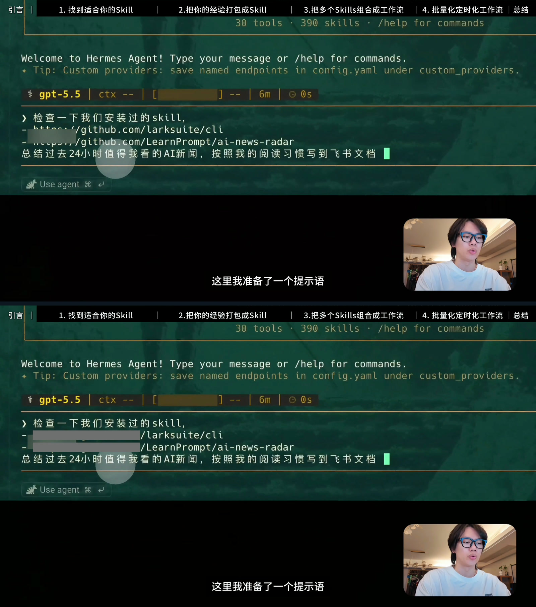
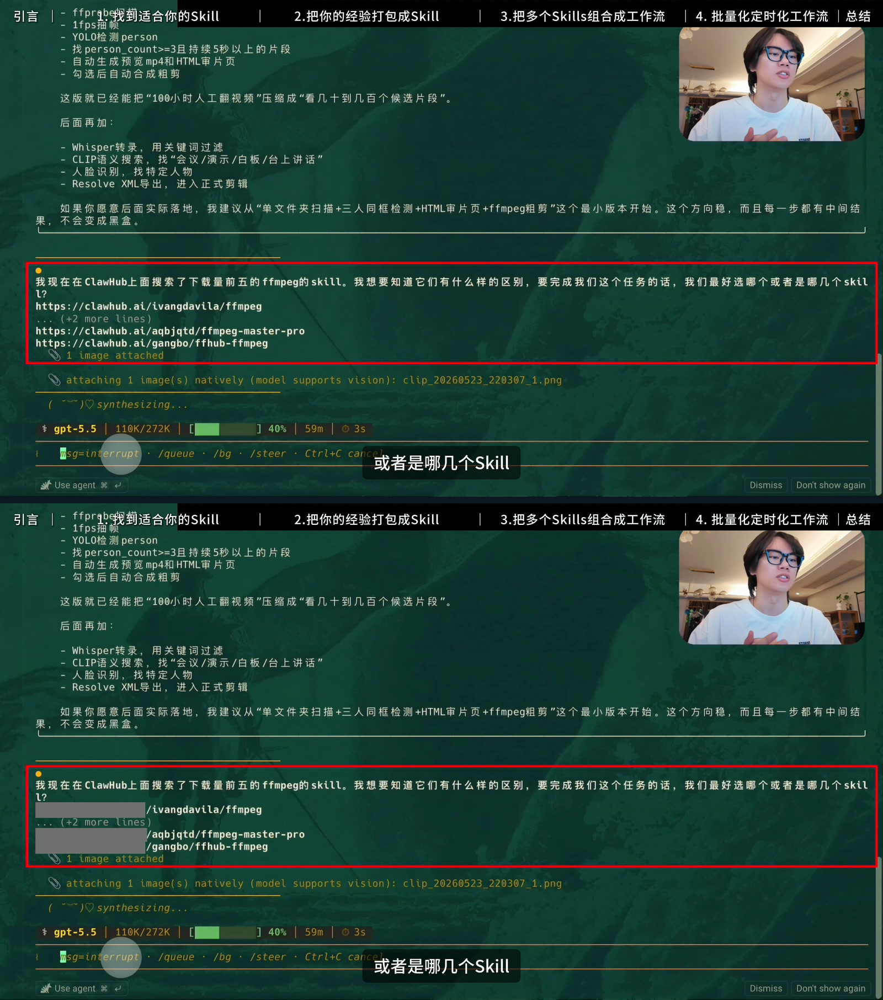
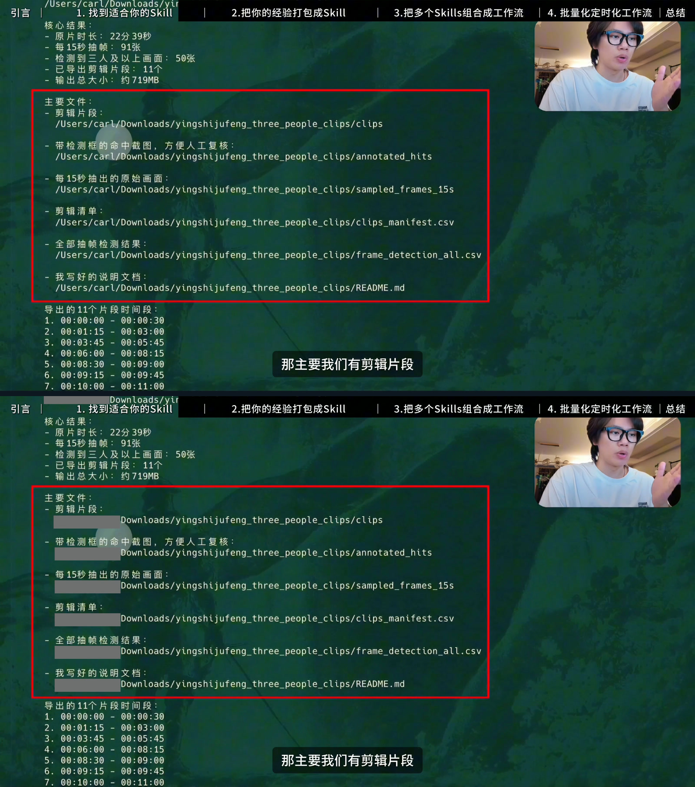
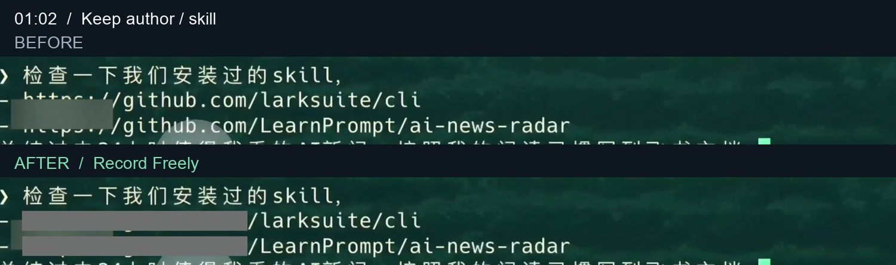
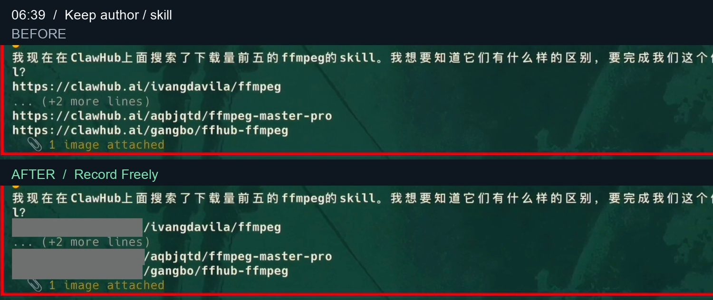
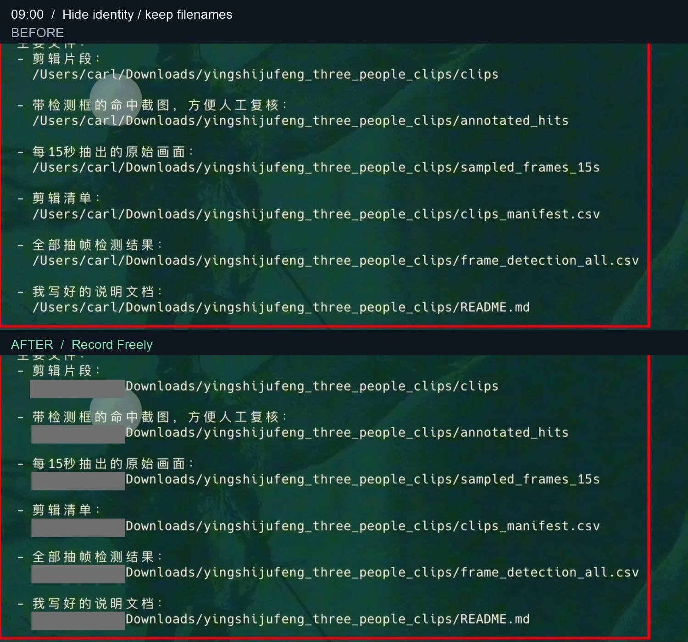
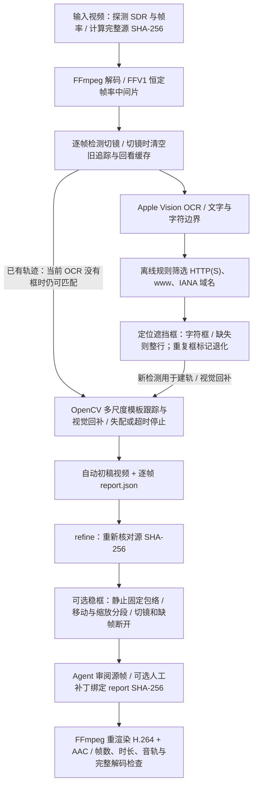

[中文](README.md) · [English](README_EN.md) · [日本語](README_JA.md)

# 放心录 · Record Freely

**先把内容录下来，再把需要遮挡的地方交给 Agent。**

[GitHub](https://github.com/LearnPrompt/record-freely) · [下载与一分钟样片](https://github.com/LearnPrompt/record-freely/releases/tag/v1.0.1) · [公开复查](docs/public-review.md)

[前后对比](https://learnprompt.github.io/record-freely/) · [实现说明](references/implementation.md) · [成本与耗时](docs/cost-and-time.md) · [在线拖动滑杆](https://learnprompt.github.io/record-freely/)

录教程时，总有一些瞬间让人停下来：终端里突然出现链接，文件路径带着自己的用户名，页面一放大，原本不起眼的地址占了半个屏幕。怕发布时被误判，于是重录、剪掉、逐帧补码。最后，被打断的是你想分享的那件事。

放心录来自一次真实的修改。我们在影视飓风相关剪辑工作流的录屏里，处理了一段 **35 分 29 秒、4K、30fps** 的视频。最开始能盖住地址，但框会抖，会把 Skill 名字盖掉，也会在鼠标高亮时漏掉一行。跟着实际反馈，我们把作者与 Skill 名字留下，把 `/Users/…/` 身份前缀遮掉，再让停住的框保持稳定、移动的框跟着画面走。

这就是 LearnPrompt 一直在做的事：从“看见可以做到”，到“学会怎么做”，再到“做成一个自己能复用的工具”。这一次，不用因为屏幕里一个地址而中断分享。

新 Agent 从公开仓库独立跑完一分钟真实4K样片：自动初稿 **4分54秒**，稳框50秒，最终补丁渲染41秒；另有约33分钟的 Agent 审阅/修订跨度，含等待和重叠计算，不能相加或当纯人工时间。已保留作者/Skill 名并撤销几类误遮，标题交叉处仍有12帧漏框。见[完整试用与实际视频](docs/one-minute-trial.md)。

## 看看改了什么

下面先看**完整画面**：每张对照图上方是输入原片，下方是 v3 打码终稿，来自同一时刻，不裁去讲解者、字幕或终端上下文。源片已有灰块照原样保留；下方新增的实色框才是这次处理的结果。

### 01:02：链接前半段遮住，作者和 Skill 名留下



### 06:39：放大的地址也遮住，Skill 的找法仍然可读



### 09:00：在影视飓风素材的剪辑教程里，只收起个人路径前缀

这段录屏展示如何给影视飓风素材筛选三人及以上同框的片段。完整画面保留讲解者、字幕、检测结果和文件用途，能看见这个 Skill 实际用在什么教程里。这里对个人路径前缀的处理来自逐帧审阅后的补丁。



[拖动完整画面滑杆](https://learnprompt.github.io/record-freely/) · [查看原尺寸 4K 源帧与成片帧](assets/full-frame-comparisons/) · [准确帧号与文件哈希](assets/full-frame-comparisons/manifest.json)

<details>
<summary>展开局部细节，检查遮挡边界</summary>

作者和 Skill 名由源字形审阅确认，不是默认自动推断；文件目录和文件名保留用途。







</details>

案例来自创作者学习和实践影视飓风相关剪辑工作流的录屏，名称交代素材背景；不表示官方合作。

## 所有打码片段，单独看一遍

[播放／下载打码片段合集](https://github.com/LearnPrompt/record-freely/releases/download/v1.0.1/all-masked-segments.mp4) · [下载 55 个独立片段及复现资料](https://github.com/LearnPrompt/record-freely/releases/download/v1.0.1/masked-segment-clips.zip) · [原片时间与合集位置索引](docs/masked-segment-collection.md)

按 v3 最终逐帧报告提取全部新增打码画面：106 段严格连续区间，共 13,407 个打码帧。合并不超过 1 秒的短间隙后，得到 **55 个片段、7分40.9秒** 的合集，额外 14 秒是明确标记的上下文。片段保持原速和完整画面，输出 1080p、30fps，保留对应音频；不是只挑几个成功镜头。源片录制时已有的灰块不在这份新增打码记录的统计范围内。

## 怎么用

目前支持 **macOS**。需要 Xcode Command Line Tools、FFmpeg、Python 3，以及 `opencv-python` 和 `numpy`。处理过程在本机完成，视频帧不会被引擎上传到云端。**无需额外下载 YOLO 或 OCR 模型权重**：文字识别使用 macOS 自带 Apple Vision；Swift 源码由 Xcode 命令行工具编译。

从仓库取得完整源码，再复制到 Agent 的 skills 目录。例如 Codex：

```bash
git clone https://github.com/LearnPrompt/record-freely.git
mkdir -p ~/.codex/skills
cp -R record-freely ~/.codex/skills/
```

也可通过支持的 Skill 安装器尝试 `npx skills add LearnPrompt/record-freely`；此安装器命令尚未在本次交付中验证。已有同名 Skill 时先保留旧副本。

然后告诉 Agent：

> 用 $record-freely 处理这条录屏。只遮看起来像链接的内容；保留教学文字。先做短预览，检查缩放、滚动和闪烁，再输出完整视频与检查报告。

也可以直接运行自动初稿：

```bash
python3 scripts/redact_video.py /absolute/input.mp4 \
  --output-dir /absolute/new-output --ocr-workers 3
```

OCR 先找文字，再用离线域名规则筛选疑似链接；OpenCV 模板匹配跟随位置与缩放。稳框阶段对静止文字使用固定覆盖框，遇到移动、缩放、切镜或检测间隙分段处理，减少框大小反复变化。

人工修改和稳框入口见 [实现说明](references/implementation.md)。自动检测、人工修补和最终检查是不同阶段，报告会分别说明。输入源片保持不变，输出使用新目录。

## 可选隐私检查与成片复查

默认仍只处理疑似网址。加 `--privacy` 后，可同时检查邮箱、大陆手机号、有标签的电话、个人路径前缀和二维码；路径后面的目录与文件用途尽量保留。低置信度或缺少位置证据的候选留在待审清单，不凭猜测画框。候选分别记录为 `mask`（可遮挡）、`needs_review`（待确认）或 `keep`（保留），报告不保存识别到的地址或联系方式原文。

```bash
# 新建隐私模式初稿；先选与实际素材相符的短片段
python3 scripts/redact_video.py /absolute/input.mp4 \
  --output-dir /absolute/privacy-preview --privacy --start 60 --duration 20

# 对最终编码文件独立复扫，不沿用初稿的框作为检测结论
python3 scripts/review_video.py /absolute/final.mp4 \
  --output-dir /absolute/new-review --privacy --detect-every 1

# 可选：本地完整音轨转写，并分别检查一个或多个现有 SRT 字幕来源
python3 scripts/review_video.py /absolute/final.mp4 \
  --output-dir /absolute/new-review-with-speech --privacy \
  --asr-model /absolute/local-whisper-model.bin \
  --subtitle /absolute/captions.srt
```

语音检查需要已有的 `whisper-cli` 和本地模型；不自动下载模型，不向云端传送音视频。未提供 `--asr-model` 时会明确记录“音频未检查”，与“没有音轨”或“转写失败”分开。临时转写用于检测后清理，匿名报告不保留 ASR 原文；已有字幕作为独立来源，`--subtitle` 可以重复指定。语音、字幕候选只提醒，脚本不自动静音、改字幕或重写视频内容。

复查输出 `review.json`，各音轨分别检查；SRT 时间须从原视频零点开始，不能使用片段相对时间。成片复查默认每个归一化 CFR 帧 OCR；`--detect-every N` 改为抽样时，报告保留覆盖与失败记录。`--start` 和 `--duration` 可限定复查窗口；窗口外不属于已检查范围。逐帧也可能识别失败，变帧率转为 CFR 时可能重复或丢弃源帧。未发现候选不等于零泄漏。最终仍需看短闪、滚动、转场、首次出现、上下缘裁切与字幕交叉处。复查不修改输入影片。

平台发布前检查另交给 Agent：结合画面、语音、字幕、上下文和有来源的规则，记录来源日期、适用场景及真实反馈；用户想多遮哪些内容单独记录。它不把工具名或未经验证的反馈写成平台禁词，也不承诺过审。见[发布前检查工作流](docs/prepublication-review.md)与[空白记录模板](references/platform-review-template.json)。

这些流程借鉴了 [guoshen](https://github.com/huangbai-AI/guoshen) 的证据提取、候选复核和反馈区分思路，由放心录按原有遮挡引擎实现；未复制整套代码或平台规则库。历史 4K 案例与一分钟试用的成绩只对应当时版本，不是新增隐私和复扫模块的测试结果。

新增实现已通过本次 **121 项测试**，包括真实 Vision 的单帧短闪／二维码复扫、双音轨时间偏移、字幕多来源和错误成片哈希拒绝。另用36帧合成视频验证遮挡像素，并用已有 Whisper 模型检查两条本地合成语音轨。详见[本次新增能力验证](docs/privacy-review-validation.md)。这些结果不代表长视频零遗漏或平台通过。

可加 `--redaction-report /absolute/final/report.json` 核对成片哈希；稳框／人工补丁重渲染后用最新报告。身份路径字符框不可靠时留待复核，同画面相邻的拆分地址仅生成待审线索，不自动扩大遮挡。

## 算法怎样工作

下图对应当前源码；默认先生成自动初稿，再由 Agent 审阅，按需稳框和修补。HDR 输入会被拒绝，需要先用单独流程转为 SDR。



图示逻辑阶段，并非每帧严格串行。OCR worker 可以并行预取；当前 OCR 没有检测框时，已有轨迹仍可依靠画面匹配续接，后续检测也可视觉回补前帧。

字符框退化可能多挡；稳框与跟踪也可能漏码。最后仍要检查实际画面，技术检查不等于视觉验收。详见 [实现说明](references/implementation.md)。

## 这次实测

| 项目 | 可核实结果 |
| --- | --- |
| 素材 | 35:29.033，3840 × 2160，30fps，63,871 帧 |
| 一个 5 分钟片段的自动初稿 | 13 分 56 秒；这是首段实测，不含开发、人工修订和最终验收 |
| 本地方案 | Apple Vision OCR + OpenCV 跟踪/稳框 + FFmpeg；不调用云端视觉模型 |
| 最终技术检查 | 全片视频/音频完整解码、连续 PTS、原音轨编码包一致、采样同步通过 |
| 最终合并对照 | 73 个准确时间戳取样点与已复验分段的原生像素一致 |
| Codex 额度 | Agent 会消耗 Codex 额度；会话 token 记录不能直接换算额度，项目额度和节省量尚无账单归因 |

[成本与耗时](docs/cost-and-time.md)附记录来源。不能把“本地处理无云端 API 调用”说成“Codex 零消耗”，也不能把一个片段的自动初稿时间说成全片终稿时间。未来对同一片段、同一验收标准做基线测试，才有依据谈额度节省。

## 它能帮到哪里

放心录检测**视觉上像网址的文字**，跟随其移动和缩放，并用较小的实色框遮挡。路径、指定词、链接保留哪几段，可通过审阅后的区域修改实现。默认不把所有路径、邮箱和 `.html` 文件名都当网址。

这能减少发布前可见地址带来的顾虑，但平台规则与识别结果不由 Skill 控制；它不能保证过审。最终仍要看链接首尾、缩放、切镜与邻近文字。本案例还有一个旧反馈未定位：25:41 的 `.html`，准确源帧为天平动画，保留在复查记录中。

此前公开版本的 70 项核心代码测试与 9 项合集工具测试通过，包含新试用发现的 Vision 重复整行框报告标签回归。历史版本的 144 帧真实 OCR 合成夹具通过。独立 Agent 从源码复跑、逐像素核对六张真实对照图，并重新计算完整复查数据集哈希；发现的源视频绑定问题已修复并复验。见[独立复查](docs/independent-review.md)。

## 交给下一个 Agent

从 [公开复查入口](docs/public-review.md)开始：网页可读源码、测试、三语说明、同帧对照与匿名指标证据，不必下载整部原片。需要实跑时，在 [v1.0.1 Release](https://github.com/LearnPrompt/record-freely/releases/tag/v1.0.1)取得 `trial-source-00m55s-01m55s.mp4`：原片 **00:55–01:55**，1 分钟、4K、30fps。新 Agent 的实跑结果需另看实际报告，不能从历史案例推断。

完整历史数据集保存在本机 **full-review-bundle/**：原片、全部 work/ 与 outputs/、原实现和正式包快照，约 **68.5 GB**。公开的[全文件清单](evidence/full-review-file-catalog.json)记录路径、大小和 SHA-256；清单不是全部媒体的下载包。轻量公开复查与全量本地审计的范围见[复查说明](docs/reviewer-handoff.md)。

公开仓库与 Release 是交付目标，文件是否实际可读、可下载应以对应网页和发布验证记录为准。

由 [LearnPrompt](https://learnprompt.pro) 出品。把录屏里的一个麻烦，变成下一次可以直接调用的 Skill。
