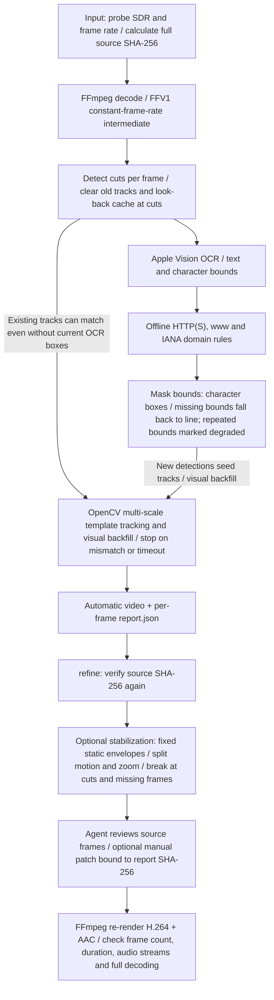

[中文](README.md) · [English](README_EN.md) · [日本語](README_JA.md)

# Record Freely · 放心录

**Record the idea first. Let your Agent handle the parts that need masking.**

[GitHub](https://github.com/LearnPrompt/record-freely) · [Downloads and one-minute clip](https://github.com/LearnPrompt/record-freely/releases/tag/v1.0.1) · [Public review](docs/public-review.md)

[Before / after](https://learnprompt.github.io/record-freely/) · [Implementation](references/implementation.md) · [Cost and time](docs/cost-and-time.md) · [Online comparison sliders](https://learnprompt.github.io/record-freely/)

A URL appears in your terminal. A file path reveals your username. A zoom makes a small address fill the screen. You pause, record again, or spend the evening adjusting masks. The thing you wanted to teach gets interrupted.

Record Freely grew from an actual **35:29, 4K, 30fps** screen recording of a workflow for editing content related to Media Storm (影视飓风). Our first masks covered the addresses, but some jittered, hid Skill names, or missed a row under the cursor highlight. We revised the real frames: retain the author and Skill name, hide the personal home-directory prefix, keep static masks steady, and follow real movement.

That follows LearnPrompt’s story: see what is possible, learn how to do it, and turn it into something you can use again. A visible address should not interrupt your willingness to share.

A fresh Agent ran a real one-minute 4K clip: **4m54s** automatic, 50s stabilization, and 41s final patch rendering. Agent review/correction spanned about 33 min including waits and overlapping computation; these are not additive or human hands-on time. A 12-frame title-overlap leak remains. See the [actual trial, reports and videos](docs/one-minute-trial.md).

## Full-frame before and after

Each board shows the **entire frame**: the input above and the v3 output below, at the same instant. The presenter, subtitles, and terminal remain visible. Existing masks in the input are preserved; this pass adds the solid masks visible in the lower frame.

### 01:02: hide the URL prefix, retain its author and Skill name


### 06:39: mask enlarged addresses while preserving how to find the Skill


### 09:00: hide personal path prefixes in a Media Storm editing tutorial

The recording shows a workflow that selects shots with three or more people from Media Storm material. The full frame retains the presenter, subtitles, detection results, and useful filenames. Personal prefixes were selected through reviewed edits.


[Full-frame sliders](https://learnprompt.github.io/record-freely/) · [Original-size 4K frame files](assets/full-frame-comparisons/) · [Exact frame IDs and hashes](assets/full-frame-comparisons/manifest.json)

<details>
<summary>Inspect the cropped masking boundaries</summary>

Retained author/Skill components were verified from the source text, not inferred automatically.


</details>

This creator's recording documents learning and applying a workflow using Media Storm material. The name describes the case background, not an official partnership.

## Every masked segment, collected

[Watch/download the collection](https://github.com/LearnPrompt/record-freely/releases/download/v1.0.1/all-masked-segments.mp4) · [55 individual clips and reproduction files](https://github.com/LearnPrompt/record-freely/releases/download/v1.0.1/masked-segment-clips.zip) · [Original and collection timeline index](docs/masked-segment-collection.md)

The final v3 frame reports identify 106 contiguous masked runs, totaling 13,407 masked frames. Joining gaps of at most one second produces **55 clips and a 7m40.9s collection**, including 14 seconds explicitly marked as context. Every reported masked frame is retained at original speed, with full framing and matching audio, exported at 1080p30. This is not a selection of successful examples. Masks already present in the recording are outside the scope of these added-mask reports.

## Use it

Currently **macOS only**. Requires Xcode Command Line Tools, FFmpeg, Python 3, `opencv-python`, and `numpy`. The processing engine runs locally and does not upload video frames. **No separate YOLO or OCR model weights need downloading**: recognition uses Apple Vision built into macOS, with the Swift worker compiled by Xcode command-line tools.

Get the complete source from GitHub and copy it into your Agent’s skills folder, for example:

```bash
git clone https://github.com/LearnPrompt/record-freely.git
mkdir -p ~/.codex/skills
cp -R record-freely ~/.codex/skills/
```

A compatible Skill installer may also support `npx skills add LearnPrompt/record-freely`; that installer command has not been validated in this delivery. Preserve an existing installation before replacing it.

Then ask:

> Use $record-freely on this screen recording. Mask text that looks like a link, keep instructional text readable, show a short preview, then deliver the complete video and inspection report.

Or run the automatic first pass:

```bash
python3 scripts/redact_video.py /absolute/input.mp4 \
  --output-dir /absolute/new-output --ocr-workers 3
```

OCR locates text, and offline domain rules select likely links. OpenCV template matching follows position and scale. Stabilization holds a fixed covering rectangle for static text and splits motion, zoom, cuts, and observation gaps into separate runs to reduce repeated size changes.

See [implementation notes](references/implementation.md) for reviewed rectangle edits and stabilization. Automatic detection, reviewed edits, and final inspection are distinct stages. The source remains intact; outputs go into a new directory.

## Optional privacy checks and independent output review

The default still masks likely URLs only. Add `--privacy` to check email addresses, mainland Chinese mobile numbers, labeled phone numbers, personal path prefixes, and QR codes as well, while retaining useful path components where possible. Candidates without reliable recognition or bounds stay in a review queue. Each is marked `mask`, `needs_review`, or `keep`; reports omit the recognized addresses and contact details.

```bash
# Make a short privacy-mode first pass
python3 scripts/redact_video.py /absolute/input.mp4 \
  --output-dir /absolute/privacy-preview --privacy --start 60 --duration 20

# Independently scan the encoded output
python3 scripts/review_video.py /absolute/final.mp4 \
  --output-dir /absolute/new-review --privacy --detect-every 1

# Optionally inspect local speech and existing SRT subtitles
python3 scripts/review_video.py /absolute/final.mp4 \
  --output-dir /absolute/new-review-with-speech --privacy \
  --asr-model /absolute/local-whisper-model.bin \
  --subtitle /absolute/captions.srt
```

Speech inspection requires an installed `whisper-cli` and an existing local model. It neither downloads a model automatically nor uploads media. Without `--asr-model`, audio is explicitly recorded as unchecked, separately from absent audio or transcription failure. Temporary transcripts are cleaned up; anonymous reports omit ASR text. Existing subtitles are independent sources, and `--subtitle` may be repeated. Speech and subtitle candidates are reminders; the scripts do not mute speech, edit subtitles, or rewrite content.

Review writes `review.json` and checks audio tracks separately. SRT timestamps must start at the original video’s zero point, not the selected clip’s zero point. Output review defaults to OCR on every normalized CFR frame. `--detect-every N` enables sampling and records coverage and failures. `--start` and `--duration` limit the inspected window; content outside it remains unchecked. Normalizing variable frame rates to CFR may duplicate or omit source frames. Even every-frame OCR can fail or miss text. Inspect flashes, scrolling, transitions, first appearances, clipped edges, and subtitle overlaps. Review leaves the input intact.

Platform review is a separate Agent workflow using audiovisual context and sourced policies. Keep source dates, applicable scenarios, user preferences, observed feedback, and inferred causes separate. Tool names and unverified feedback do not become platform keyword bans. See the [prepublication workflow](docs/prepublication-review.md) and [blank record template](references/platform-review-template.json). Approval is not guaranteed.

The workflow draws on [guoshen](https://github.com/huangbai-AI/guoshen)'s evidence, candidate review, and feedback separation, implemented around Record Freely's own engine without importing its full code or policy library. Historical 4K and one-minute results describe their original versions, not validation of these new modules.

The new implementation passed **121 tests**, including real Vision single-frame flash/QR rescans, audio-track offsets, independent subtitle sources and rejection of mismatched output hashes. Separate local runs verified concealment in a 36-frame synthetic video and checked two synthesized speech tracks with an existing Whisper model. See [validation scope](docs/privacy-review-validation.md). This does not establish zero missed content in long videos or platform approval.

Use `--redaction-report /absolute/final/report.json` to bind a rescan to the final output hash; use the newest report after refinement. Identity prefixes with unreliable character geometry remain pending. Spatially adjacent address fragments produce review hints, never automatic enlarged masks.

## How the algorithm works

This diagram follows the current source. The default run produces an automatic first pass; the Agent reviews it and optionally stabilizes or patches it. HDR input is rejected and needs a separate SDR conversion workflow first.



The diagram shows logical stages, not a strict per-frame sequence. OCR workers may prefetch concurrently. Existing tracks can continue through visual matching without current OCR boxes, and later detections may visually backfill earlier frames.

Degraded character bounds can overmask; stabilization and tracking can still miss text. Inspect the actual frames: technical checks are not visual acceptance. See [implementation notes](references/implementation.md).

## What we measured

| Item | Evidence |
| --- | --- |
| Input | 35:29.033, 3840 × 2160, 30fps, 63,871 frames |
| Automatic first pass on one 5-minute segment | 13m 56s, excluding development, manual revisions, and final acceptance |
| Engine | Apple Vision OCR, OpenCV tracking/stabilization, FFmpeg; no cloud vision model calls |
| Final technical validation | Full video/audio decoding, continuous PTS, identical original audio packet payloads, sampled AV alignment |
| Final assembly samples | 73 exact-timestamp samples matched the inspected chunks in native pixels |
| Codex allowance | Agent work consumes Codex allowance. Session token telemetry does not directly identify account allowance or project savings |

[Cost and time](docs/cost-and-time.md) links the underlying records. Zero cloud vision calls does not mean zero Codex use. Segment first-pass time is not full-film completion time. A savings claim needs a measured baseline under the same acceptance criteria.

## Scope

The Skill finds **visible text that resembles a URL**, follows movement and scale, and applies narrow solid masks. Reviewed edits can select path prefixes, words, or retained URL components. Keeping author/Skill suffixes and tuning personal paths require source-frame review; they are not universally automatic. Ordinary paths, email addresses, and `.html` filenames are not all treated as URLs by default.

This helps reduce visible-address concerns before publishing. It cannot guarantee platform approval or zero missed text. Check appearances, disappearances, zooms, cuts, and adjacent text. One older case item remains unlocated: the reported `.html` at 25:41, where the exact source frame shows a scales animation.

The previously published version passed 70 core code tests and 9 collection-tool tests, including a regression for repeated whole-line Vision character bounds discovered in the fresh trial. The historical 144-frame real-OCR synthetic fixture passed. An independent Agent reran the code, checked all six real comparison images pixel for pixel, and recalculated the dataset hashes. The discovered source-binding flaw was fixed and retested. See the [independent review](docs/independent-review.md).

## Review from another machine

Start with the [public review guide](docs/public-review.md). Browse source, tests, three-language documentation, same-frame comparisons, and anonymized evidence without downloading the full film. For a real run, get `trial-source-00m55s-01m55s.mp4` from the [v1.0.1 Release](https://github.com/LearnPrompt/record-freely/releases/tag/v1.0.1): the original **00:55–01:55** segment, one minute, 4K, 30fps. A fresh Agent trial requires its own actual output and report; the historical case does not establish that result.

The complete historical **full-review-bundle/** remains local: original video, every work/ and outputs/ file, and the original and formal Skill snapshots, approximately **68.5 GB**. The public [file catalog](evidence/full-review-file-catalog.json) records paths, sizes, and SHA-256 hashes; it is not a download of all media. See [reviewer handoff](docs/reviewer-handoff.md) for the different scopes of lightweight public review and full local auditing.

The linked repository and Release are the delivery targets. Verify availability and downloads from the live pages and publication verification records.

By [LearnPrompt](https://learnprompt.pro). Turn one screen-recording problem into a Skill you can call next time.
