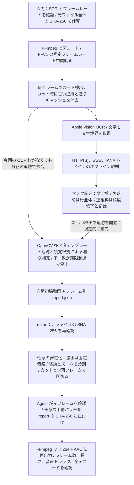

[中文](README.md) · [English](README_EN.md) · [日本語](README_JA.md)

# 放心录 · Record Freely

**まず伝えたいことを録画する。隠す必要がある部分は、あとから Agent に任せる。**

[GitHub](https://github.com/LearnPrompt/record-freely) · [ダウンロード・1分の素材](https://github.com/LearnPrompt/record-freely/releases/tag/v1.0.1) · [公開レビュー](docs/public-review.md)

[処理前と処理後](https://learnprompt.github.io/record-freely/) · [実装](references/implementation.md) · [コストと処理時間](docs/cost-and-time.md) · [オンライン比較](https://learnprompt.github.io/record-freely/)

ターミナルに URL が現れる。ファイルパスに自分のユーザー名が映る。画面を拡大すると、小さなアドレスが目立つ。気になって録り直したり、一コマずつマスクを直したりするうちに、本来伝えたかった内容が中断されてしまいます。

放心录は、影视飓风（Media Storm）のコンテンツに関連する編集ワークフローを紹介した、**35分29秒、4K、30fps** の実際の画面録画から生まれました。最初はアドレスを隠せても、マスクが揺れ、Skill 名まで隠れ、カーソルのハイライトで一行を見失うことがありました。実際の映像を確認しながら、作者名と Skill 名は残し、個人のホームディレクトリ部分を隠し、静止中は枠を安定させ、動く画面には追従するよう修正しました。

LearnPrompt が続けている「できると知る → やり方を学ぶ → 自分で使える形にする」という流れです。画面の中のアドレス一つで、共有する気持ちを止めないための Skill です。

新しい Agent が公開 Skill で実際の1分4K動画を処理しました。自動初稿 **4分54秒**、安定化50秒、最終パッチ出力41秒。Agent の確認・修正は待機や重複計算を含む約33分で、合算や人の操作時間とは異なります。タイトルと重なる12フレームの漏れが残っています。[実際の試用・報告・動画](docs/one-minute-trial.md)を参照してください。

## 画面全体で処理前と処理後を比べる

各画像の**上が元動画、下が v3 の処理結果**です。同じ時刻の画面全体を使い、説明者、字幕、ターミナルを切り落としていません。録画時からあるマスクはそのまま残し、今回追加した矩形を下の画面で確認できます。

### 01:02：URL の前半を隠し、作者名と Skill 名を残す


### 06:39：拡大されたアドレスも隠し、Skill の探し方を残す


### 09:00：影视飓风の素材を扱う編集チュートリアルで個人パスを隠す

この録画では、影视飓风（Media Storm）の素材から3人以上が同時に映るショットを抽出する流れを説明しています。説明者、字幕、検出結果、ファイルの用途を残し、映像を確認したパッチで個人パスの接頭部分を隠しています。


[全画面スライダー](https://learnprompt.github.io/record-freely/) · [元サイズの4Kフレーム](assets/full-frame-comparisons/) · [フレーム番号とハッシュ](assets/full-frame-comparisons/manifest.json)

<details>
<summary>マスク境界の拡大図を見る</summary>

作者名と Skill 名は元の文字を確認して残しています。自動推測ではありません。


</details>

事例は、制作者が影视飓风の素材を使った編集ワークフローを学び、実践する録画です。名称は背景の説明であり、公式な協業を示すものではありません。

## マスクした全区間をまとめて確認する

[まとめ動画を再生・ダウンロード](https://github.com/LearnPrompt/record-freely/releases/download/v1.0.1/all-masked-segments.mp4) · [55本の個別動画と再現資料](https://github.com/LearnPrompt/record-freely/releases/download/v1.0.1/masked-segment-clips.zip) · [元動画とまとめ動画の時刻一覧](docs/masked-segment-collection.md)

v3 の最終フレーム報告にある追加マスクは、連続106区間、13,407フレームです。1秒以下の間隔を結合すると、**55本、7分40.9秒**になります。そのうち14秒は前後関係を残す区間として明記しています。報告中のマスクフレームをすべて通常速度で残し、画面全体と対応する音声を1080p・30fpsで出力しています。成功例だけの抜粋ではありません。録画時からあったマスクは今回の追加マスク報告の集計対象外です。

## 使い方

現在は **macOS 対応**です。Xcode Command Line Tools、FFmpeg、Python 3、`opencv-python`、`numpy` が必要です。処理エンジンはローカルで動作し、動画のフレームをクラウドへ送信しません。**YOLO や OCR のモデル重みを別途ダウンロードする必要はありません**。macOS 内蔵の Apple Vision を使い、Swift のワーカーを Xcode のコマンドラインツールでコンパイルします。

GitHub からソース全体を取得し、Agent の skills フォルダーへコピーします。Codex の例：

```bash
git clone https://github.com/LearnPrompt/record-freely.git
mkdir -p ~/.codex/skills
cp -R record-freely ~/.codex/skills/
```

対応するインストーラーでは `npx skills add LearnPrompt/record-freely` も候補ですが、今回このコマンドは検証していません。同名の Skill がある場合は、更新前に旧版を保存してください。

Agent に次のように依頼します。

> $record-freely でこの画面録画を処理してください。リンクに見える文字を隠し、説明文は読めるように残してください。短いプレビューを確認してから、動画全体と確認レポートを出力してください。

自動処理の初稿を直接作成することもできます。

```bash
python3 scripts/redact_video.py /absolute/input.mp4 \
  --output-dir /absolute/new-output --ocr-workers 3
```

OCR で文字の位置を取得し、オフラインのドメイン規則でリンク候補を選びます。OpenCV のテンプレート照合で移動と拡大・縮小に追従します。静止文字には文字を覆う固定矩形を使い、移動、ズーム、カット、観測の途切れで区間を分け、枠の大きさの変動を抑えます。

確認済みの矩形修正とマスク安定化については、[実装説明](references/implementation.md)を参照してください。自動検出、映像を見て行う修正、最終確認は別の工程です。元動画は変更せず、新しい出力先を使います。

## アルゴリズムの流れ

現在のソースに対応した図です。通常は自動初稿を作成し、Agent が確認して、必要に応じて枠の安定化やパッチを行います。HDR 入力は拒否されるため、別の手順で SDR に変換する必要があります。



図は論理的な工程を示し、毎フレームの厳密な逐次処理ではありません。OCR ワーカーは並行して先読みできます。今回の OCR 枠がなくても既存の追跡を画像照合で継続し、後の検出から前のフレームを視覚的に補完できます。

文字枠の精度低下で余分な文字が隠れることがあり、安定化や追跡にも検出漏れが残ります。実際の画面を確認してください。技術チェックは視覚的な合格判定とは別です。[実装説明](references/implementation.md)を参照してください。

## 今回確認できたこと

| 項目 | 確認結果 |
| --- | --- |
| 元動画 | 35:29.033、3840 × 2160、30fps、63,871フレーム |
| 5分の一部分を自動処理した初稿 | 13分56秒。開発、手動修正、最終確認は含まない |
| 方式 | Apple Vision OCR、OpenCV の追跡・安定化、FFmpeg。クラウド視覚モデルは呼び出さない |
| 最終技術確認 | 映像・音声の全デコード、連続 PTS、元音声パケットの一致、音声と映像の同期サンプル確認 |
| 結合後の比較 | 正確な時刻の73サンプルが、確認済み部分動画のネイティブ画素と一致 |
| Codex の利用枠 | Agent の作業は Codex の利用枠を消費する。会話のトークン記録だけでは、案件の消費枠や削減量に換算できない |

根拠は[コストと処理時間](docs/cost-and-time.md)に記載しています。クラウド視覚 API の呼び出しがゼロでも、Codex の消費がゼロとは限りません。一部分の初稿の時間を、全体の完成時間として示しません。同じ条件と合格基準で比較して初めて、削減量を測れます。

## 対応範囲

**見た目が URL に似ている文字**を検出し、移動や拡大・縮小に追従して、小さめの単色マスクを付けます。確認済みの領域指定で、パスの接頭部分、単語、残す URL 要素を調整できます。作者名と Skill 名を残す判断や個人パスの調整には、元フレームの確認が必要です。通常のパス、メールアドレス、`.html` ファイル名を一律に URL として扱いません。

公開前のアドレス表示に関する不安を減らすためのツールです。プラットフォームの審査通過や検出漏れゼロを保証するものではありません。出現・消失、ズーム、カット、隣の文字を確認してください。以前の指摘のうち、25:41 の `.html` はまだ特定できていません。該当する正確な元フレームは天秤のアニメーションでした。

現在の70件のコアコードテストと9件のまとめ動画ツールテストが通りました。新しい試用で見つかった Vision の同一行範囲を返す文字枠について、レポート表示の回帰テストを含みます。以前の144フレームの実 OCR 合成動画テストも通っています。独立した Agent がソースから再実行し、実フレームの比較画像6枚を画素単位で照合し、資料全体のハッシュも再計算しました。発見された元動画の紐付け不具合は修正・再検証済みです。[独立復査](docs/independent-review.md)を参照してください。

## 別のマシンから復査する

[公開レビューの手順](docs/public-review.md)から始めてください。ソース、テスト、三言語の説明、同フレーム比較、匿名化した根拠資料は、元動画全体をダウンロードせずに読めます。実行用には [v1.0.1 Release](https://github.com/LearnPrompt/record-freely/releases/tag/v1.0.1) の `trial-source-00m55s-01m55s.mp4` を使います。元動画の **00:55–01:55**、1分、4K、30fps の区間です。新しい Agent の試用結果には、その実際の出力とレポートが必要です。過去の事例から結果を推定しません。

約 **68.5 GB** の完全な履歴資料 **full-review-bundle/** はローカルに保存しています。元動画、work/ と outputs/ の全ファイル、元実装と正式パッケージのスナップショットを含みます。公開する[全ファイル一覧](evidence/full-review-file-catalog.json)は、パス、サイズ、SHA-256 の記録であり、全動画のダウンロードではありません。軽量な公開レビューとローカルの全量監査の範囲は[引き継ぎ説明](docs/reviewer-handoff.md)に記載しています。

リンク先のリポジトリと Release が公開先です。閲覧・ダウンロードの可否は、実際のページと公開検証記録で確認してください。

[LearnPrompt](https://learnprompt.pro) より。画面録画で出会った困りごとを、次回も呼び出せる Skill に。
