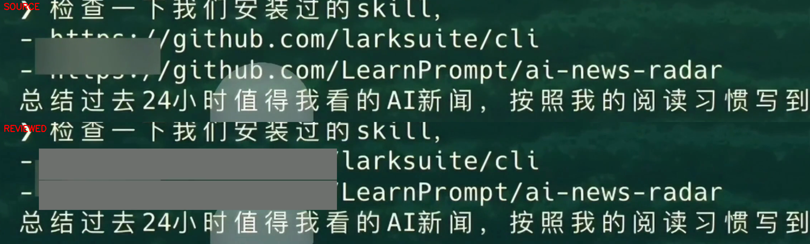
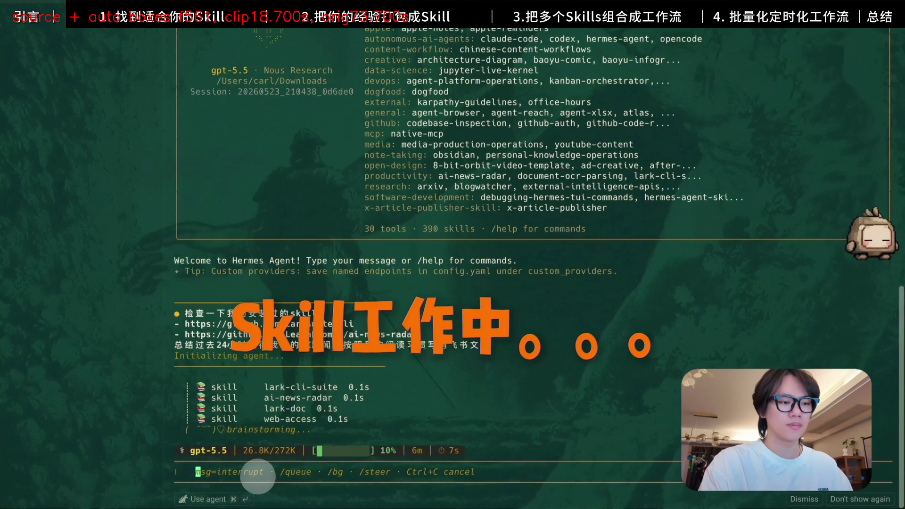

# 新 Agent 独立试用：放心录 · Record Freely

公开附件：[一分钟输入](https://github.com/LearnPrompt/record-freely/releases/download/v1.0.1/trial-source-00m55s-01m55s.mp4) · [自动初稿](https://github.com/LearnPrompt/record-freely/releases/download/v1.0.1/trial-automatic.mp4) · [纯稳框](https://github.com/LearnPrompt/record-freely/releases/download/v1.0.1/trial-stable.mp4) · [人工修订试用版（仍有漏码）](https://github.com/LearnPrompt/record-freely/releases/download/v1.0.1/trial-reviewed.mp4) · [完整一分钟复查包](https://github.com/LearnPrompt/record-freely/releases/download/v1.0.1/complete-one-minute-review.zip)。

下文为新 Agent 原始报告。绝对路径记录真实执行位置；复跑时换成你本机输入路径和新输出目录。完整包包括输入、所有输出、补丁、审阅帧、辅助脚本和测试源码快照，排除 Git 配置与缓存。

维护方已修正重复整行字符框的报告标签，同一真实源帧新旧遮挡框完全一致，见[原生 OCR 回归](../evidence/metadata-geometry-regression.json)。该修正未解决复杂标题交叉漏码。当前70项测试通过；本次独立试用固定在602a2fcb，独立测试为当时69项。


完成了真实 60 秒视频的自动初稿、稳框、最小人工修订和媒体技术验证。**这是成功完成的试用与复查，修订输出仍有已定位漏码，不能称为可发布终版、完全自动或零漏码。**

## 来源与独立性

从公开仓库 https://github.com/LearnPrompt/record-freely 重新 git clone，固定提交 `602a2fcb02678ce69142f838563d9758ecd293e0`。阅读公开 `SKILL.md` 与 `references/implementation.md`，使用仓库 `redact_video.py`、`refine_video.py`、`stabilize_masks.py`。未使用本机安装的 Skill、作者私有补丁或历史 v3 成片；未修改公开 clone 源码，未全局安装或下载模型。首次直接跑完整 60 秒、3 OCR workers，是本轮明确指定的流程；源片预览与审阅与扫描并行。

输入 `publication/assets/trial-source-00m55s-01m55s.mp4` 是原片 00:55–01:55，CFR 30fps、3840×2160、1800 帧、SDR BT.709、一条 AAC 音轨。输入已有少量灰块，全部保留，不重建已隐藏文字。作者明确授权该样片和对照 PNG 用于公开复查。

输入 SHA256：`efd875d321d814a1a50e13cf259325dbf2b7377250d3d9fb2a3914e619f592f4`。结束后重算相同，原片未改。

## 可复现命令

在这个公开 clone 内执行，输入绝对路径相同，以下 `$INPUT` 代表上述输入：

```sh
TRIAL='/Users/carl/Downloads/放心录-视频打码-2026-10-07/publication/fresh-agent-trial'
INPUT='/Users/carl/Downloads/放心录-视频打码-2026-10-07/publication/assets/trial-source-00m55s-01m55s.mp4'
cd "$TRIAL/record-freely"
python3 scripts/redact_video.py "$INPUT" --output-dir "$TRIAL/automatic" --ocr-workers 3
python3 scripts/refine_video.py "$INPUT" --report "$TRIAL/automatic/report.json" --stabilize --output-dir "$TRIAL/stable"
python3 scripts/refine_video.py "$INPUT" --report "$TRIAL/automatic/report.json" --stabilize --patch "$TRIAL/reviewed-patch-v2.json" --output-dir "$TRIAL/reviewed-v2"
```

补丁 SHA 绑定未经改写的 `automatic/report.json`；`review/make_review_patch.py` 和 `review/patch-rationale-v2.json` 保留具体人工像素依据。人工补丁逐帧替换完整框集合，保留该帧其他有效框。

## 实际耗时与环境

| 环节 | 墙钟秒 | 口径 |
|---|---:|---|
| 完整自动 OCR/渲染 | 293.58 | 原自动报告进程 elapsed_seconds |
| 稳框重渲染 | 50.05 | 原稳框报告进程时间 |
| 首轮人工补丁渲染 | 34.30 | 保留但不作为最终输出 |
| 最终 v2 补丁渲染 | 40.93 | 最终报告进程时间 |
| 后缀几何辅助 OCR 尝试 | 36.51 | 发现退化后拒绝使用 |
| Agent 审阅/修订整个跨度 | 1991.26 | 从首次源片抽审开始到报告收尾，含等待与重叠计算 |
| Agent 人工纠正尝试跨度 | 1554.59 | 从辅助几何脚本创建到最终验收/收尾，含审阅、脚本、两轮渲染和解码 |

这些跨度不是纯人工操作秒数，不能相加为总耗时。没有真人秒表记录，真人 hands-on 时间为未知。没有同口径 Codex 前后账单/额度快照，不能报 token、金额或省了多少。自动 OCR 在本机运行，不代表 Agent 消耗为零。

环境：macOS 27.0.1 arm64、Python 3.9.6、OpenCV 4.13.0、NumPy 2.0.2、FFmpeg 8.1、已有 Xcode Command Line Tools/macOS Vision。

## 真片发现与修订

| 内容/场景 | clip 时间 | 原片时间 | 实际观察 |
|---|---|---|---|
| 两行 GitHub 安装链接 | 首次观测 6.867s，末次观测 20.433s | 01:01.867–01:15.433 | 自动遮整行作者/Skill 后缀；先静止、后滚动、缩放与橙色大字交叉 |
| Models.dev 查询/产品名 | 36.600s、37.600s 等实例 | 01:31.600、01:32.600 | 一些查询里的裸域名被遮，45–50s绿色产品标题保留；规则一致性仍有限 |
| AI 新闻 API 域名短闪 | f1110 / 37.000s | 01:32.000 | 一帧源画面包含实际域名；有效地址框保留 |
| HN API 命令链接 | 37.467–37.800s（自动观测区间） | 01:32.467–01:32.800 | 与普通 `urllib.parse` 代码混排，需区别真实网址与误遮 |
| X / API 文档链接 | 44.867–49.567s（不同链接先后退出） | 01:39.867–01:44.567 | 高亮背景、切换与滚动；稳框原框保留 |
| 两处飞书文档地址 | 50.200–59.967s | 01:45.200–01:54.967 | 上方提示框与下方长命令；下方链接右边受人物层遮挡，框长度/高度抖动 |

这些是观测时间和实例，不是所有源帧的人工真值标注；时间变换为原片秒数 = clip 秒数 + 55。

最小修订对 f206–518 量源像素后使用 x=208..1036，y/高跟随当帧已观测行框，隐藏 GitHub 前缀同时保留 `larksuite/cli`、`LearnPrompt/ai-news-radar`。未用字符数推像素，未给缺失帧猜框。f1517–1799 下方飞书行固定 x=1216..2890、y=1706..1814，右边止于实际人物层左边，保留 `lark-cli docs +fetch --doc`。

确认并取消的误遮：f1110 `datetime.datetime.now`；f1124–1134 `urllib.parse`；f1182–1193 顶部“3.把多个 Skills组合成工作流”；后段间歇性 `lark-cli docs`。总补丁覆盖 620 帧，不等于 620 帧都曾漏码。

首轮人工补丁误把稳框 S* ID 当原 U* ID，局部像素回读发现三类误遮未撤销。最终 v2 改为使用稳定报告 `source_ids`，重新渲染并回读；第一轮视频、补丁仍保留，不能与 v2 混用。

额外发现：在此 macOS 上，源 f300 的 GitHub 行中 Vision 每个字符 boundingBox 都等于整行框，公开原报告却标 `box_method=characters`。辅助 OCR 也有重复整行/零框退化，已标为 `rejected_for_patch_use`，未用于最终矩形。该问题已报告维护方；本次 clone 与输出先于后续报告标签修正，标签修正本身不证明多挡或漏码已解决。

## 仍需修正

- **f561–572：clip 18.700–19.067s，原片 01:13.700–01:14.067，12 帧明确漏框。** 结束边界按半开区间为 clip19.100s/原片01:14.100。源片橙色“Skill工作中”覆盖部分链接，灰矩形容易同时伤标题。最终仍采用公开稳框结果，未做颜色像素恢复或无证据扩框。
- f531–532（clip17.700–17.733s / 原片01:12.700–01:12.733）也有标题交叉和部分网址片段未充分遮挡。
- 更广的 f519–613（clip17.300–20.433s / 原片01:12.300–01:15.433）未全面人工改写；作者/Skill 后缀仍可能多挡、框有缺失。需要可信干净标题图层或明确的逐帧人工几何再审。
- 裸域名作产品名的保留策略和 OCR 一致性仍需明确；不提供全片 precision/recall 或零漏码结论。

## 审阅和验证边界

源片与首轮人工修订按 clip0..59 每秒抽帧全跨度审阅；最终 v2 对修改差异处 f1110、f1128、f1182、f1650、f1691 回读，并复用未修改区间的前轮抽样；自动初稿审了6..11、18..23、42..59秒对照，稳框重点审42..59秒。另查看出现/消失、缩放、短闪和误遮的指定源帧与像素裁切，包括 f205/206、f531、f565、f590、f613/614、f1098、f1110、f1128、f1182/1193、f1505/1506、f1650、f1791。图在 `review/`，完整时间与选择在 JSON 中。不是逐帧人工观看1800帧，也没有逐段听完音频；全部1800帧自动OCR和完整技术解码不能替代视觉真值。

公开 clone 静态回归：69 tests passed，2.74 秒。自动、稳框、首轮人工和最终 v2 四份输出都是3840×2160、30fps、1800帧、视频60.000秒、一条AAC音轨60.000秒，均经 `ffmpeg -v error -xerror -i FILE -f null -` 完整解码，exit0、stderr空。输入结束SHA相同。详见 `technical-verification.json`。音频重编码，不宣称数据包或听感完全相同；没有平台审核或实发布验证。

## 文件与 SHA256

| 输出 | SHA256 |
|---|---|
| `automatic/redacted.mp4` | `b7cf7de26efcc153d3812f9f359e90497eaf1b1acdfcca738412edb4ed394df2` |
| `stable/redacted.mp4` | `76363282ebfc50cfeba61353d409ba77003c90cc4327a75f69817755aa8359e9` |
| `reviewed/redacted.mp4` | `60a82c72899d55a1fd369faee249941882c55519e12b073595a938297847989e` |
| `reviewed-v2/redacted.mp4` | `b86ae7f85c1ddff942f1ce0c032b25418ae4439beb62f472a875535c9af4999b` |

建议复查交付：`reviewed-v2/redacted.mp4`，保持“含人工修订、仍有已定位漏码”的标签。未经人工修正的初稿 `automatic/redacted.mp4` 与纯稳框 `stable/redacted.mp4` 均保留。补丁 `reviewed-patch-v2.json` SHA256：`9ee3103e13484bc7c8c2746278c9400b28b7716f259eec27d2ab61acf4df6f4a`。最终交付路径：`/Users/carl/Downloads/放心录-视频打码-2026-10-07/publication/fresh-agent-trial/reviewed-v2/redacted.mp4`。





